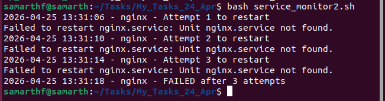

# Linux Administration & Shell Scripting Tasks

A collection of Linux system administration scripts covering process monitoring, service management, log analysis, disk usage, log cleanup, and input validation.

---

## Repository Structure

```
├── linux_task_1.sh                # Task 1 – Top memory processes & log file utilities
├── service_monitor_2.sh           # Task 2 – Service monitor with auto-restart
├── log_analyzer_script_3.sh       # Task 3 – Log file analyzer
├── disk_monitor_4.py              # Task 4 – Disk usage monitor (Python)
├── ip_validate_6.sh               # Task 6 – IPv4 address validator
└── README.md
```

---

## Task Overview

### Task 1 – System Monitoring Commands

A set of one-liner shell commands to quickly inspect system health:
- View the top 5 memory-consuming processes
- Find files larger than 100MB inside `/var/log`
- Count all `.log` files on the system recursively
- Check whether a specific process (e.g. nginx) is running
- Tail the last 50 lines of a log file and filter for `ERROR` entries

**How to run:**
```bash
bash linux_task_1.sh
```

---

### Task 2 – Service Monitor (`service_monitor_2.sh`)

Checks if a given system service is running. If it is not, the script will automatically attempt to restart it up to 3 times, logging every action with a timestamp.

**How to run:**
```bash
bash service_monitor_2.sh nginx
```

**Exit codes:**

| Code | Meaning |
|------|---------|
| `0` | Service is running or was successfully restarted |
| `2` | Service failed to restart after all retries |

**Log file:** `/tmp/service_monitor.log`

**Sample log output:**
```


samarthf@samarth:~/Tasks/My_Tasks_24_Apr$ bash service_monitor2.sh 
2026-04-25 13:31:06 - nginx - Attempt 1 to restart
Failed to restart nginx.service: Unit nginx.service not found.
2026-04-25 13:31:10 - nginx - Attempt 2 to restart
Failed to restart nginx.service: Unit nginx.service not found.
2026-04-25 13:31:14 - nginx - Attempt 3 to restart
Failed to restart nginx.service: Unit nginx.service not found.
2026-04-25 13:31:18 - nginx - FAILED after 3 attempts
samarthf@samarth:~/Tasks/My_Tasks_24_Apr$ 

```

---

### Task 3 – Log Analyzer (`log_analyzer_script_3.sh`)

Parses a log file and counts the total number of `ERROR` and `INFO` entries. Also shows the top 3 most frequently occurring error messages.

**How to run:**
```bash
bash log_analyzer_script_3.sh /var/log/syslog
```

**Sample output:**
```
ERROR: 42
INFO: 158

Top 3 frequent ERROR messages:
  12 Connection refused
   8 Timeout exceeded
   5 Disk read error
```

---

### Task 4 – Disk Usage Monitor (`disk_monitor_4.py`)

A Python script that checks the current disk usage of the root partition (`/`). If usage exceeds 80%, it prints a warning to the terminal and appends the alert to `disk_alerts.log`.

**Requirements:** Python 3

**How to run:**
```bash
python3 disk_monitor_4.py
```

**Sample output:**
```
Disk Usage: 3 %

```

**Alert log file:** `disk_alerts.log` (created in the same directory)

---

### Task 5 – Log Rotation (logrotate)

A `logrotate` configuration that automatically manages log files in `/var/log/myapp/`.

**What it does:**
- Rotates logs daily
- Keeps the last 7 rotations
- Compresses old logs (with a one-day delay)
- Adds a date stamp to rotated file names
- Skips rotation if the log file is empty

---

#### Step 1 – Create the log folder

```bash
sudo mkdir -p /var/log/myapp
sudo touch /var/log/myapp/app.log
```

#### Step 2 – Add some data to the log (required, empty files are skipped)

```bash
echo "ERROR something failed" | sudo tee -a /var/log/myapp/app.log
echo "INFO app started" | sudo tee -a /var/log/myapp/app.log
```

#### Step 3 – Create the logrotate config

```bash
sudo nano /etc/logrotate.d/myapp
```

Paste the following and save:

```
/var/log/myapp/*.log {
    daily
    rotate 7
    compress
    delaycompress
    missingok
    notifempty
    create 0640 root root
    dateext
}
```

#### Step 4 – Test (force run)

```bash
sudo logrotate -f /etc/logrotate.d/myapp
```

#### Step 5 – Check the result

```bash
ls -l /var/log/myapp
```

i saw the original log and a rotated copy:

```
app.log
app.log-20260425
```

#### Step 6 – Check compression

Run logrotate again, then list the files:

```bash
sudo logrotate -f /etc/logrotate.d/myapp
ls -l /var/log/myapp
```

The previous rotated log will now be compressed:

```
app.log-2026-04-25.gz
```

#### Step 7 – Verify old log deletion

Run logrotate multiple times to simulate multiple days:

```bash
for i in {1..10}; do sudo logrotate -f /etc/logrotate.d/myapp; done
ls /var/log/myapp
```

Only the last 7 logs are kept. Anything older is deleted automatically.

#### Step 8 – Verify automation (systemd timer)

```bash
systemctl list-timers | grep logrotate
```

If `logrotate.timer` appears in the output, logrotate is already scheduled to run daily automatically. No manual timer setup is needed.

**Summary:**

| Feature           |  Meaning                                      |
|----------------   |-----------------------------------------------|
| `/var/log/myapp`  | Where logs are stored                         |
| `rotate 7`        | Keep last 7 logs                              |                      
| `compress`        | Compress old logs                             |
| `delaycompress`   | Compress from the next cycle (not the latest) |
| `logrotate.timer` | Runs automatically every day via systemd      |   

---

### Task 6 – IPv4 Address Validator (`ip_validate_6.sh`)

An interactive script that prompts the user to enter an IPv4 address and validates it in a loop until the user quits.

**Validation rules:**
- Must have exactly 4 octets separated by dots
- Each octet must be a number between `0` and `255`

**How to run:**
```bash
bash ip_validate_6.sh
```

**Sample interaction:**
```
Enter IP address: 192.168.1.1
IP is valid
Press Enter to continue or 'q' to quit:

Enter IP address: 999.0.0.1
IP is not valid
Press Enter to continue or 'q' to quit: q
```

---
